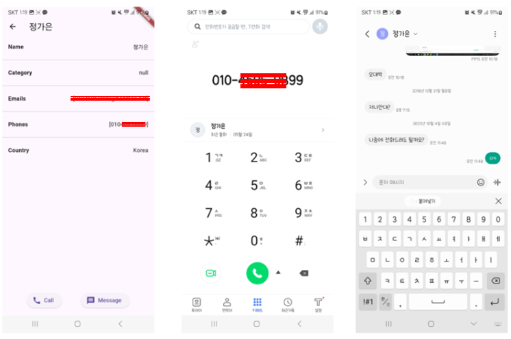
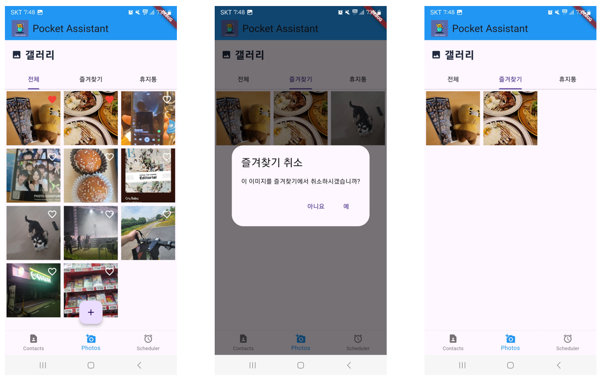
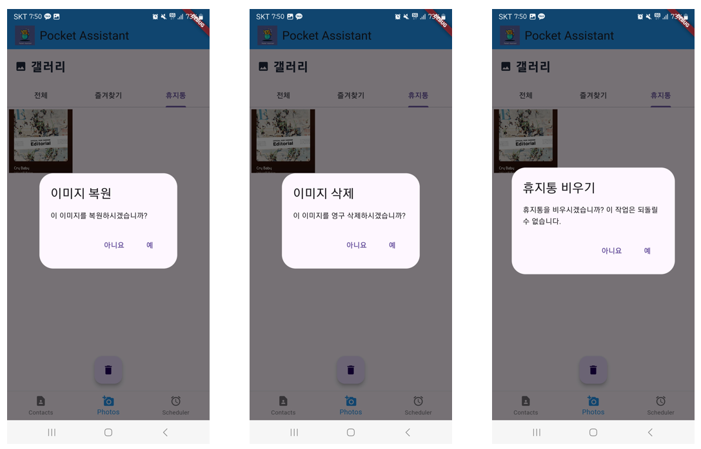

# <Week 1> Team Project (2024 Summer) : [PA : Pocket Assistant]

 

## 🤼 팀 멤버 정보

1. [정다영](https://www.notion.so/madcamp/ca29f9f848474061a9cedba2cffbf032?pvs=4)
    

   

 

2. [정인호](https://www.notion.so/madcamp/f51fae3248a747fcb3100942d2a666f9?pvs=4)
    

   

 

## 💻 Tech Stack
- `Frontend` : [Flutter](https://flutter.dev/)
   

- `IDE` : [Android Studio](https://developer.android.com)

 

## 📱 기능 (Functionalities)
### Tab 1 : 연락처 기능

- **권한을 얻어 연락처 정보를 가져오는 기능**
  - 연락처 정보 권한을 얻어서 가져온 정보를 **Recycler View**를 통해서 정리

  

 

- **각 연락처 정보마다 상세 정보 보여주기**
  - `Json` 을 이용해서 데이터화
  - 연락처 저장 정보를 통해 `문자열 parsing`을 이용해서 `Category` 추가

 

- **상세정보를 통해서 바로 전화 & 메세지 걸기**
  - 상세정보 화면에서 📞, 💬 버튼을 누르면 해당 연락처로 전화, 문자 기능으로 바로 연결

  

 

- **검색 기능**
  - 검색해서 연락처 정보를 바로 볼 수 있음

  

---
### Tab 2 : 갤러리 기능
- **기본적인 갤러리 기능 구현**
  - `사진 권한` : 휴대전화에 있는 앨범 정보 불러오기
  - `카메라 권한` : 카메라로 바로 찍어서 갤러리에 업로드 가능

  

- **즐겨찾기 기능**
  - Tab 2 의 메인 화면에서 우측상단에 ❤️ 이모티콘을 누르면 즐겨찾기 탭에 추가/해제 할수 있음
  - Tab 2 의 즐겨찾기 탭에서 해당 사진을 길게 누르면 즐겨찾기를 해제할 수 있음

  

- **휴지통 기능**
  - Tab 2 의 메인 화면에서 사진을 길게 누르면 휴지통으로 사진을 이동 시킬 수 있음
  - `복원 기능` : 휴지통 탭에서 사진을 터치하면 다시 갤러리로 복원 가능
  - `삭제 기능` : 휴지통 탭에서 사진을 길게 누르면 그 사진을 영구 삭제 할 수 있음
  - `휴지통 비우기` : 휴지통에 있는 모든 사진들을 비우기 버튼으로 삭제 가능

  

---
### Tab3 : 과제 스케쥴러
💡 학교 [KLMS](https://klms.kaist.ac.kr) 에서 과제 D-day 기간을 까먹고 놓친 경험에서 나온 아이디어이다.

위와 같이 알림 기능이 부실해서 실시간으로 파악하기 불가능  
⇒ 항상 손에 들고 다니는 휴대전화에 알리미를 추가하면 효과적일 것이라 기대

- **과제 스케줄러에 추가/삭제 하기**
  - 메인 탭에서 ➕ 버튼을 누르면 과제를 스케쥴러에 추가시킬수 있다
  - Due Date를 설정하면 해당 과제가 무엇인지 입력하는 창이 뜨며, 입력하면 과제가 설정한 날짜에 과제가 등록된다.
  - 해당 과제탭을 길게 누르면 과제를 삭제할 수 있다.

  

- **등록한 과제들을 달력을 통해서 볼 수 있음**
  - 메인 탭에서 좌측 상단 아이콘을 터치하면 달력 화면으로 전환된다.
  - 해당 날짜에 대한 과제가 🔴로 찍힌다.
  - 해당 날짜를 터치하면 아래에 상세정보가 나온다.

  

- **하루 전, 3일 전일 때 push 알림 기능**
  

- **해당 항목 D-day 지나면 자동으로 삭제**
  

## 🎮 실행 모습(Execution)

<table>
  <tr>
    <td></td>
    <td></td>
    <td></td>
  </tr>
</table>

---
### Release Apk

[Pocket Assitant : Drive를 통해 다운로드](https://drive.google.com/drive/folders/1MzhX94tWfji_ZuEttN-0B0Mqc6cCaw0q)
